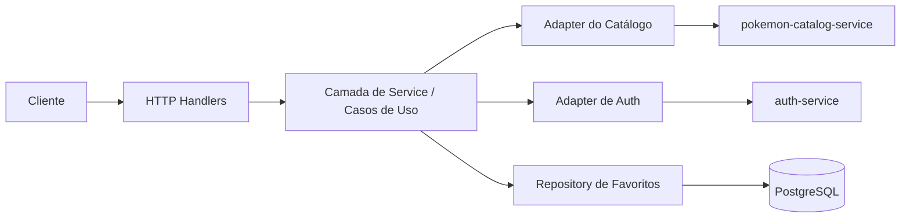
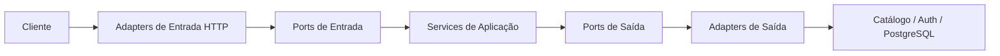

# BFF

## Objetivo

O `mobile-bff` é a aplicação voltada ao cliente dentro da plataforma. O papel dele não é ser a fonte de verdade de todo o domínio, mas sim fornecer respostas moldadas para a experiência mobile e web.

## Responsabilidades Atuais

- Expor endpoints HTTP orientados ao frontend.
- Agregar dados do `pokemon-catalog-service`.
- Gerenciar favoritos de usuário.
- Delegar fluxos de autenticação ao `auth-service`.
- Retornar respostas já moldadas para consumo de UI.

## Diagrama De Comunicação Do BFF

## Como Ler Esse Diagrama

- O cliente conversa com o BFF por HTTP.
- Os handlers recebem e validam transporte.
- A camada de `service` orquestra os casos de uso.
- O adapter de catálogo chama o `pokemon-catalog-service`.
- O adapter de auth chama o `auth-service`.
- O repository de favoritos persiste no `PostgreSQL`.

## O Que O BFF Deve Possuir

- Orquestração de requisições.
- Composição de respostas orientadas à experiência.
- Propagação de sessão e identidade.
- Contratos específicos para o cliente.

## O Que O BFF Não Deve Possuir

- Regras canônicas do catálogo de Pokémon, que pertencem ao `pokemon-catalog-service`.
- Lógica central de autenticação, que pertence ao `auth-service`.
- Decisões específicas de infraestrutura vazando para o código de caso de uso.

## Estado Da Arquitetura Hexagonal

O BFF atual está razoavelmente bem alinhado com arquitetura hexagonal:

- `internal/domain` mantém modelos centrais independentes de transporte.
- `internal/ports` define contratos de entrada e saída.
- `internal/service` funciona como camada de aplicação implementando casos de uso.
- `internal/adapters/http` e `internal/adapters/repository` funcionam como adaptadores de entrada e saída.

## Diagrama Hexagonal Simplificado

O principal ponto não era apenas o layout de pastas. O principal ponto era a direção das dependências em algumas partes do código.

## Principais Pontos De Melhoria

### 1. Remover mocks de teste do bootstrap de produção

Antes, `cmd/server/main.go` importava `tests/mocks` para montar fallbacks de runtime. Isso fazia a composição de produção depender de um pacote de teste.

Direção recomendada:

- mover implementações de fallback para `internal/adapters/repository`
- manter `tests/` apenas para utilitários de teste

### 2. Substituir a dependência de auth concreta por uma porta

Antes, o handler HTTP dependia do client concreto de auth.

Direção recomendada:

- criar uma porta de saída como `AuthProvider`
- deixar o fluxo HTTP depender de um caso de uso de auth
- manter `AuthServiceClient` como adapter que implementa a porta

### 3. Evitar bypass da camada de caso de uso

Antes, o handler recebia tanto o `favoriteUseCase` quanto o `favoriteRepo`. Quando um adapter de entrada fala direto com repositório, a camada de aplicação fica mais fácil de ser ignorada.

Direção recomendada:

- deixar handlers chamarem apenas casos de uso
- mover enriquecimentos ou coordenações extras para serviços de aplicação

### 4. Remover regras duplicadas de mapeamento

Mapeamento de cor por tipo aparece em mais de um lugar. Isso cria risco de divergência.

Direção recomendada:

- centralizar esse mapeamento em uma política de domínio ou mapper dedicado

### 5. Revisar o desenho das portas

`PokemonRepository` ainda carrega uma responsabilidade mais ampla do que a necessária em alguns pontos do modelo atual.

Direção recomendada:

- manter portas focadas por capacidade
- evitar mistura entre responsabilidade de catálogo e responsabilidade de favoritos

## Avaliação Prática

O BFF não está mal estruturado. Ele já usa o vocabulário arquitetural certo e já possui boa parte dos limites corretos. O passo mais importante foi endurecer a direção das dependências para que a arquitetura hexagonal seja garantida por código, e não apenas por nomes de pastas.
