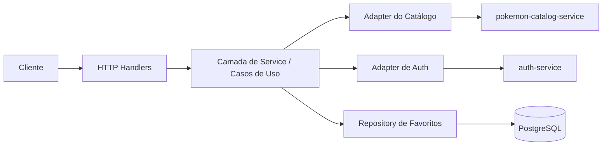
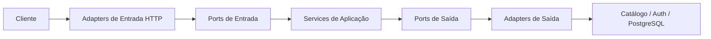

# BFF

## Objetivo

O `mobile-bff` é a aplicação voltada ao cliente dentro da plataforma. O papel dele não é ser a fonte de verdade de todo o domínio, mas sim fornecer respostas moldadas para a experiência mobile e web.

## Responsabilidades Atuais

- Expor endpoints HTTP orientados ao frontend.
- Agregar dados do `pokemon-catalog-service`.
- Gerenciar favoritos de usuário.
- Delegar fluxos de autenticação ao `auth-service`.
- Retornar respostas já moldadas para consumo de UI.

## Referência De Produto

As próximas APIs do BFF para home e detalhe devem seguir a referência visual do Figma:

- [Pokémon App By Junior Saraiva](https://www.figma.com/pt-br/comunidade/file/1202971127473077147/pokedex-pokemon-app)

Essa referência é importante porque reforça o papel do BFF como camada orientada à experiência do cliente, e não apenas como proxy técnico.

## Navegação Principal Do App

As tabs principais esperadas hoje são:

- `pokedex`: home ou lista principal
- `detalhe`: tela aberta ao selecionar um Pokémon
- `regioes`
- `favoritos`
- `perfil`

Nem todas precisam existir imediatamente como endpoints independentes, mas elas servem como mapa de evolução da API do BFF.

## Rotas Atuais Do App

No gateway local (Kong), os endpoints do BFF são expostos no prefixo `/v1`.

- `GET /v1/home`
- `GET /v1/pokemons/{id}/details`
- `GET /v1/regions`
- `GET /v1/me`
- `GET /v1/me/favorites`

Internamente, o serviço mantém as rotas com prefixo `/api/v1`.

## Contrato Atual Da Home

Estrutura atual da resposta da tela principal:

```json
{
  "title": "Pokédex",
  "search": {
    "placeholder": "Procurar Pokémon..."
  },
  "filters": {
    "types": {
      "title": "Tipos",
      "selected": "Todos os tipos",
      "items": [
        { "title": "Água" },
        { "title": "Fantasma" }
      ]
    },
    "ordering": {
      "title": "Ordenação",
      "selected": "Menor número",
      "items": [
        { "title": "Menor número" },
        { "title": "Maior número" },
        { "title": "A-Z" },
        { "title": "Z-A" }
      ]
    },
    "region": {
      "title": "Regiões",
      "items": [
        { "title": "Kanto" },
        { "title": "Johto" }
      ]
    }
  },
  "pokemons": [
    {
      "number": "Nº001",
      "name": "Bulbasaur",
      "types": [
        {
          "title": "Grama",
          "color": "63BC5A"
        },
        {
          "title": "Venenoso",
          "color": "B567CE"
        }
      ],
      "sprites": {
        "url": "https://...",
        "backgroundColor": "63BC5A"
      },
      "isFavorite": false
    }
  ]
}
```

## Observações De Modelagem Para A Home

- `search.placeholder` é parte da experiência da tela e faz sentido vir do BFF.
- `filters` são controlados pelo BFF a partir da necessidade da tela.
- `types[].color` representa a cor visual associada ao tipo.
- em `sprites.backgroundColor`, a cor representa o fundo visual do card atrás da imagem.
- a home atual usa uma coleção curada de 26 pokémons para seguir o Figma, em vez de expor a paginação bruta do catálogo.

## Consulta Da Home Por Query Params

O endpoint da home é único e aceita filtros por query string:

- `GET /v1/home`

Parâmetros suportados:

- `q`: busca por nome e número.
- `type`: filtra por tipo.
- `order`: ordenação da lista (`Menor número`, `Maior número`, `A-Z`, `Z-A`).
- `region`: filtra por região.

Exemplos de uso:

```text
GET /v1/home?q=char
GET /v1/home?type=Fogo
GET /v1/home?order=A-Z
GET /v1/home?region=kanto
GET /v1/home?q=char&type=Fogo&order=A-Z&region=kanto
```

Observações:

- no consumo externo via gateway, use `/v1`.
- internamente no serviço, as rotas seguem `/api/v1`.
- evite barra final em `home/` durante debug por linha de comando para não confundir o parse da resposta.

## Contrato Atual De Detalhe

Estrutura atual da tela de detalhe:

```json
{
  "number": "Nº001",
  "name": "Bulbasaur",
  "types": [
    { "title": "Grama", "color": "7AC74C" },
    { "title": "Venenoso", "color": "A33EA1" }
  ],
  "description": "Há uma semente de planta nas costas desde o dia em que este Pokémon nasce. A semente cresce lentamente.",
  "sprites": {
    "url": "https://...",
    "backgroundColor": "7AC74C"
  },
  "about": {
    "weight": { "label": "Peso", "value": "6,9 kg" },
    "height": { "label": "Altura", "value": "0,7 m" },
    "category": { "label": "Categoria", "value": "Seed" },
    "abilities": { "label": "Habilidade", "items": ["Overgrow"] },
    "gender": { "label": "Gênero", "male": "87,5%", "female": "12,5%" }
  },
  "weaknesses": [
    { "title": "Fogo", "color": "EE8130" }
  ],
  "evolutions": [
    {
      "number": "Nº001",
      "name": "Bulbasaur",
      "types": [
        { "title": "Grama", "color": "7AC74C" },
        { "title": "Venenoso", "color": "A33EA1" }
      ],
      "sprites": { "url": "https://..." }
    }
  ],
  "isFavorite": false
}
```

## Contrato Atual De Regiões

```json
{
  "title": "Regiões",
  "regions": [
    { "id": "kanto", "name": "Kanto", "generation": "1º Geração" },
    { "id": "johto", "name": "Johto", "generation": "2º Geração" }
  ]
}
```

## Contrato Atual De Favoritos

O endpoint retorna estado de tela orientado à UI:

- `state = "unauthenticated"`
- `state = "empty"`
- `state = "has_data"`

Exemplo não autenticado:

```json
{
  "title": "Favoritos",
  "state": "unauthenticated",
  "message": {
    "title": "Você precisa entrar em uma conta para fazer isso.",
    "description": "Para acessar essa funcionalidade, é necessário fazer login ou criar uma conta. Faça isso agora!",
    "cta": { "label": "Entre ou Cadastre-se", "variant": "primary" }
  },
  "pokemons": []
}
```

## Contrato Atual De Perfil

O endpoint também retorna estado de tela:

- não autenticado: `authenticated = false` com `header` e `actions`
- autenticado: `authenticated = true` com `user`, `sections`, `actions` e `footer`

Exemplo não autenticado:

```json
{
  "title": "Conta",
  "authenticated": false,
  "header": {
    "title": "Entre ou Cadastre-se",
    "description": "Mantenha sua Pokédex atualizada e participe desse mundo."
  },
  "actions": [
    { "label": "Entre ou Cadastre-se", "variant": "primary" }
  ]
}
```

## Diretriz De Modelagem UI-Oriented

Neste projeto, o BFF deve devolver payloads orientados à tela, incluindo:

- títulos e labels de blocos
- estados de tela
- mensagens de vazio e autenticação
- ações de UI (ex.: CTA)
- listas prontas para renderização

Isso mantém o frontend focado em renderização e interação, e reduz montagem de contrato no cliente.

## Diagrama De Comunicação Do BFF



## Como Ler Esse Diagrama

- O cliente conversa com o BFF por HTTP.
- Os handlers recebem e validam transporte.
- A camada de `service` orquestra os casos de uso.
- O adapter de catálogo chama o `pokemon-catalog-service`.
- O adapter de auth chama o `auth-service`.
- O repository de favoritos persiste no `PostgreSQL`.

## O Que O BFF Deve Possuir

- Orquestração de requisições.
- Composição de respostas orientadas à experiência.
- Propagação de sessão e identidade.
- Contratos específicos para o cliente.

## O Que O BFF Não Deve Possuir

- Regras canônicas do catálogo de Pokémon, que pertencem ao `pokemon-catalog-service`.
- Lógica central de autenticação, que pertence ao `auth-service`.
- Decisões específicas de infraestrutura vazando para o código de caso de uso.

## Estado Da Arquitetura Hexagonal

O BFF atual está razoavelmente bem alinhado com arquitetura hexagonal:

- `internal/domain` mantém modelos centrais independentes de transporte.
- `internal/ports` define contratos de entrada e saída.
- `internal/service` funciona como camada de aplicação implementando casos de uso.
- `internal/adapters/http` e `internal/adapters/repository` funcionam como adaptadores de entrada e saída.

## Diagrama Hexagonal Simplificado



O principal ponto não era apenas o layout de pastas. O principal ponto era a direção das dependências em algumas partes do código.

## Principais Pontos De Melhoria

### 1. Remover mocks de teste do bootstrap de produção

Antes, `cmd/server/main.go` importava `tests/mocks` para montar fallbacks de runtime. Isso fazia a composição de produção depender de um pacote de teste.

Direção recomendada:

- mover implementações de fallback para `internal/adapters/repository`
- manter `tests/` apenas para utilitários de teste

### 2. Substituir a dependência de auth concreta por uma porta

Antes, o handler HTTP dependia do client concreto de auth.

Direção recomendada:

- criar uma porta de saída como `AuthProvider`
- deixar o fluxo HTTP depender de um caso de uso de auth
- manter `AuthServiceClient` como adapter que implementa a porta

### 3. Evitar bypass da camada de caso de uso

Antes, o handler recebia tanto o `favoriteUseCase` quanto o `favoriteRepo`. Quando um adapter de entrada fala direto com repositório, a camada de aplicação fica mais fácil de ser ignorada.

Direção recomendada:

- deixar handlers chamarem apenas casos de uso
- mover enriquecimentos ou coordenações extras para serviços de aplicação

### 4. Remover regras duplicadas de mapeamento

Mapeamento de cor por tipo aparece em mais de um lugar. Isso cria risco de divergência.

Direção recomendada:

- centralizar esse mapeamento em uma política de domínio ou mapper dedicado

### 5. Revisar o desenho das portas

`PokemonRepository` ainda carrega uma responsabilidade mais ampla do que a necessária em alguns pontos do modelo atual.

Direção recomendada:

- manter portas focadas por capacidade
- evitar mistura entre responsabilidade de catálogo e responsabilidade de favoritos

## Avaliação Prática

O BFF não está mal estruturado. Ele já usa o vocabulário arquitetural certo e já possui boa parte dos limites corretos. O passo mais importante foi endurecer a direção das dependências para que a arquitetura hexagonal seja garantida por código, e não apenas por nomes de pastas.
