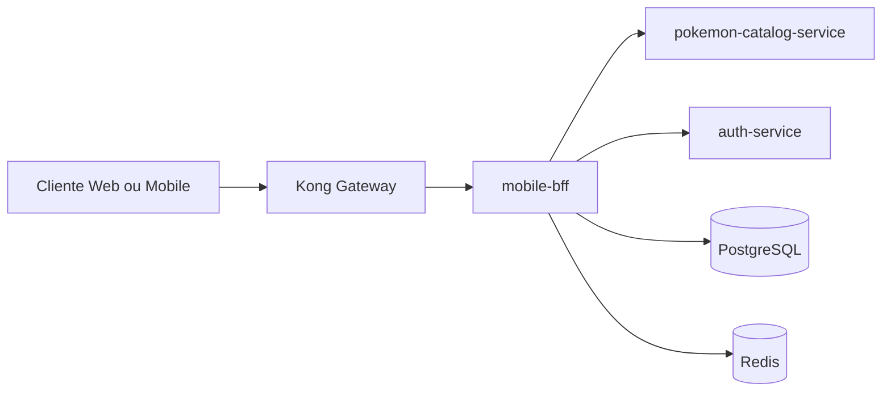
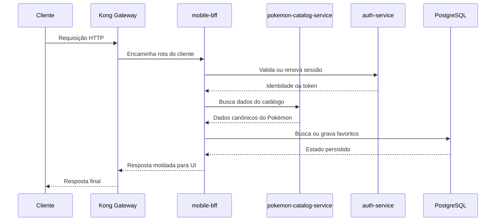

# Visão Geral Do Sistema

## Objetivo

A Plataforma Pokedex está organizada como um pequeno ecossistema de backend composto por um BFF orientado ao cliente, serviços internos, um gateway de API e infraestrutura compartilhada.

## Fluxo Principal

```text
Cliente
  -> Kong Gateway
    -> mobile-bff
      -> pokemon-catalog-service
      -> auth-service
      -> PostgreSQL
      -> Redis
```

## Diagrama Da Plataforma



## Leitura Arquitetural Do Diagrama

- O cliente não acessa os serviços internos diretamente.
- O `Kong Gateway` é o ponto de entrada público da plataforma.
- O `mobile-bff` concentra a orquestração voltada ao cliente.
- O `pokemon-catalog-service` mantém o catálogo canônico.
- O `auth-service` concentra autenticação e ciclo de vida de token.
- `PostgreSQL` e `Redis` aparecem como infraestrutura de apoio para os serviços.

## Áreas Do Repositório

### `core/app/`

Contém serviços internos de backend que expõem capacidades de negócio mais específicas.

- `auth-service`: autenticação e ciclo de vida de tokens.
- `pokemon-catalog-service`: acesso canônico ao catálogo de Pokémon.

### `core/bff/`

Contém o `mobile-bff`, o Backend for Frontend que molda respostas para a experiência do cliente e orquestra múltiplas dependências.

### `core/gateway/`

Contém a configuração declarativa do Kong usada como ponto de entrada público.

### `core/infra/`

Contém ativos compartilhados de infraestrutura, como schema do PostgreSQL, insumos para geração de seed, dados de seed gerados e configuração do Redis.

## Estilo Arquitetural

No nível do repositório, a plataforma segue uma composição orientada a serviços:

- gateway como ponto de entrada
- BFF como orquestrador voltado ao cliente
- serviços internos para capacidades específicas
- infraestrutura mantida fora do código de aplicação

## Fluxo De Comunicação Mais Comum



Dentro do `mobile-bff`, o estilo pretendido é arquitetura hexagonal. Essa intenção aparece nos pacotes `domain`, `ports`, `service` e `adapters`, embora alguns detalhes de implementação ainda possam gerar acoplamento com infraestrutura concreta.

## Pontos Fortes Atuais

- Separação clara entre BFF, serviços, gateway e infraestrutura.
- Bom uso do Docker Compose para representar a topologia de execução.
- O BFF já usa a terminologia de ports and adapters com consistência.
- Existem testes unitários e de integração no BFF.

## Pontos De Melhoria Atuais

- Algumas regras de formatação de negócio ainda aparecem duplicadas em camadas diferentes.
- Os limites entre serviços já estão claros na prática, mas ainda podem ser mais formalizados como contratos.
- A arquitetura do BFF já está bem melhor, mas ainda pode evoluir na centralização de algumas regras compartilhadas.
